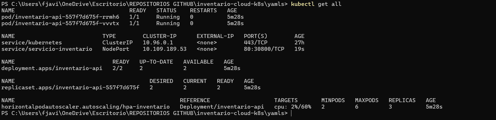
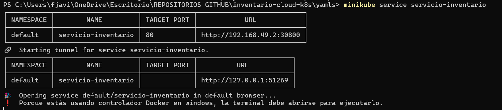
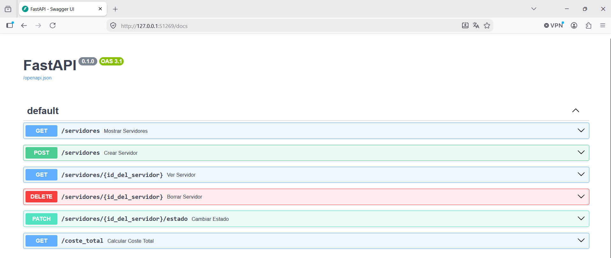
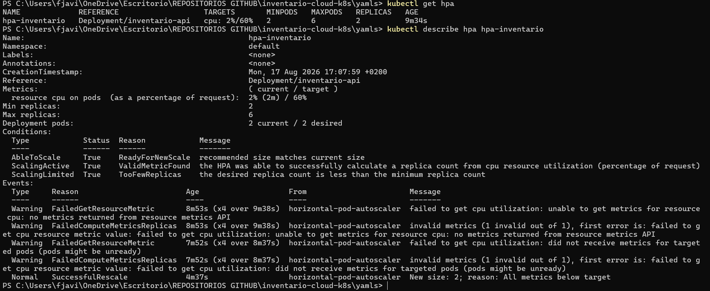
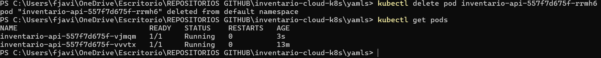

# Despliegue de una API en Kubernetes

Con este proyecto, despliego mi API que desarrollé de inventario cloud, en un clúster de Kubernetes, con réplicas, autohealing, configuración externalizada y autoescalado horizontal.

La imagen que despliego es la que yo mismo desarrollé y desplegué con FastAPI/Docker: [fjmurort/inventario-cloud-api](https://hub.docker.com/r/fjmurort/inventario-cloud-api), construida y publicada automáticamente mediante un pipeline de GitHub Actions. Lo puedes ver en [este repositorio](https://github.com/FJMurOrt/inventario-cloud-fastapi).

---

## ¿Qué he desplegado?

| Objeto | Función |
|--------|---------|
| **Deployment** | 3 réplicas de la API con límites de recursos |
| **Service** | Para exponer la aplicación mediante NodePort y repartir el tráfico entre los pods |
| **ConfigMap** | Para externalizar la configuración y no incluirla en la imagen |
| **HorizontalPodAutoscaler** | Se encarga de escarlar el número de réplicas según el uso de CPU |

---

## Estructura del proyecto

```
inventario-cloud-k8s/
├── yamls/
│   ├── deployment.yaml
│   ├── service.yaml
│   ├── configmap.yaml
│   └── hpa.yaml
├── capturas/
└── README.md
```

---

## Requisitos

- Un clúster de Kubernetes (he usado Minikube)
- kubectl configurado
- El addon `metrics-server` habilitado, necesario para el HPA:

```bash
minikube addons enable metrics-server
```

---

## Despliegue

```bash
kubectl apply -f yamls/
```

Y para comprobarlo:

```bash
kubectl get all
```



En esta salida se ve el Deployment, los pods, el Service con el mapeo `80:30800` y el HPA mostrando el uso actual de CPU frente al objetivo.

---

## Para acceder a la API

```bash
minikube service servicio-inventario
```

La documentación interactiva de la API está disponible en `/docs`.





---

## Los tres puertos del Service

| Puerto | Valor | Función |
|--------|-------|---------|
| `nodePort` | 30800 | El puerto de entrada desde fuera del clúster |
| `port` | 80 | El puerto del Service dentro del clúster |
| `targetPort` | 8000 | El puerto donde escucha uvicorn en el contenedor |

---

## Autoescalado

El HorizontalPodAutoscaler mantiene el uso medio de CPU en torno al 60%, con un mínimo de 2 réplicas y un máximo de 6.

```bash
kubectl get hpa
kubectl describe hpa hpa-inventario
```



Con el clúster en reposo el HPA reduce las réplicas al mínimo, ya que el uso de CPU está muy por debajo del objetivo.

Para que el autoescalado funcione, el Deployment debe definir `resources.requests` de CPU. Es decir, el porcentaje se calcula sobre la CPU que se necesita, no sobre la del nodo.

---

## Autohealing

Si un pod deja de funcionar, el Deployment crea otro automáticamente para mantener el número de réplicas que se hayan definido en el yaml:

```bash
kubectl delete pod <nombre-del-pod>
kubectl get pods
```



---

## Para eliminar los recursos

```bash
kubectl delete -f yamls/
```
o si te encuentras dentro del directorio

```bash
kubectl delete -f ./
```
---

## A tener en cuenta de cara al futuro

**Estado no compartido entre réplicas**
La API usa SQLite dentro del contenedor, por lo que cada pod tiene su propia base de datos, es decir, los datos no se comparten. Lo idea para mejorar esto sería una base de datos externa o con un volumen compartido.

**La configuración no consumida** 
El ConfigMap se inyecta como variables de entorno en el contenedor, pero la aplicación todavía no las lee. Sólo lo incluyo para demostrar el patrón de externalizar la configuración.

---

## Tecnologías que se han usado

- Kubernetes
- Minikube
- kubectl
- Docker
- FastAPI
